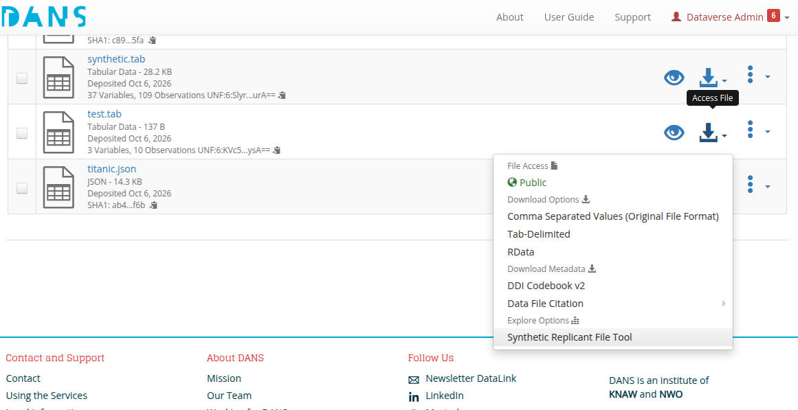
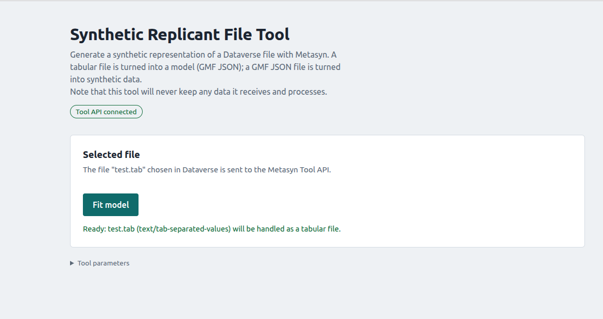
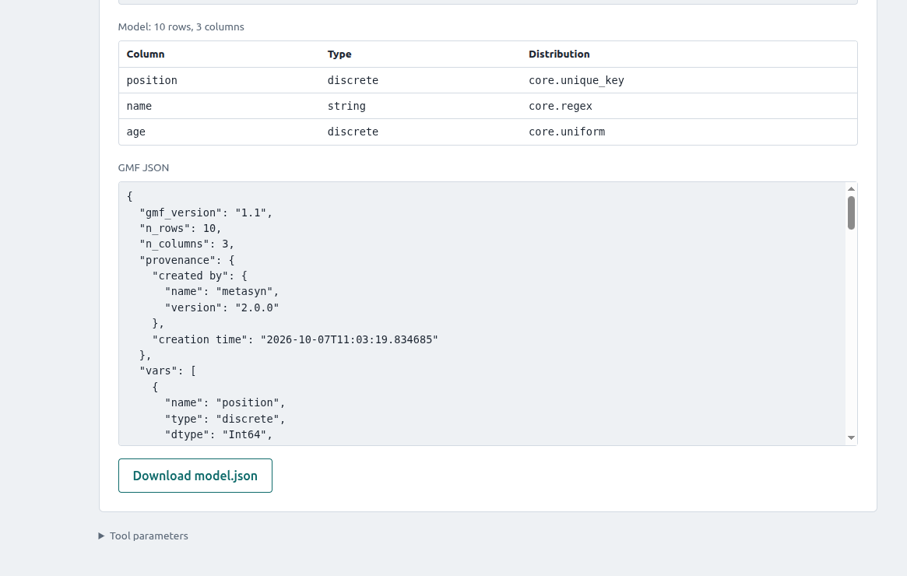
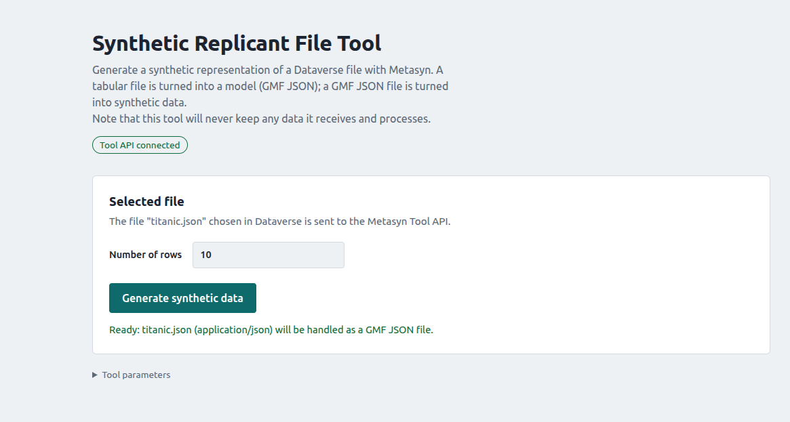
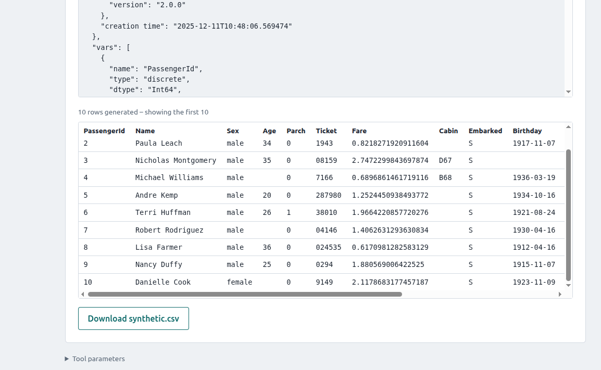

Dataverse Metasyn
=================

This is a follow-up of the work in the [dataverse_external_tools](../dataverse_external_tools/README.md) folder. 
The goal is to connect the 'External Tools' page from Dataverse to the Metasyn API (web service). Using that service we can generate GMF JSON (model) file from a tabular file. The GMF can then be download. Alternatively, when initiated from such a GMF file, we can generate synthetic data and download it. 
In contrast with the previous example, it does not provide any 'AUX' file retrieval and storage. This is technically possible, but for this example/demo it was decided to put the emphasis on the synthetic data generation. 


## Setup

Similar to that previous setup we first need to have a running Dataverse (SSH) and have it configured correctly to use the 'tools' html file. 

1. Start the SSH datastation 'dev' box.
```
start-preprovisioned-box.py -s dev_ssh dev_vocabs
```
Note the `-s`, it will start a fresh box, can be omitted later on. 

2. Copy the files
```
cp ~/git/synthetic_metadata_interop/dataverse_metasyn/* ~/git/dans-core-systems/shared/
```
And on the vagrant box (`vagrant ssh dev_ssh`)
```
sudo cp /vagrant/shared/synth-file-tool.html /var/www/html/custom/
```

3. Configure the tools in Dataverse
In vagrant
For the tabular files
```
curl -X POST -H 'Content-type: application/json' http://localhost:8080/api/admin/externalTools --upload-file /vagrant/shared/synthFileTool.json
```
For the JSON (GMF) files
```
curl -X POST -H 'Content-type: application/json' http://localhost:8080/api/admin/externalTools --upload-file /vagrant/shared/synthFileToolGmf.json
```

3. Start the API
Read that documentation, it will explain how to get it running. 
[metasyn_api](../metasyn_api/README.md)


## Demo usage

With Dataverse and the Metasyn API running (see Setup), the tool can be used on both tabular files and GMF JSON files. A tabular file is used to create a GMF model file; a GMF file is used to create synthetic data. Both results can be downloaded. 

### 1. Select the tool

Open the 'Access File' menu of a file in Dataverse and choose 'Synthetic Replicant File Tool' under 'Explore Options'.



### 2. Generate a GMF model from a tabular file

The tool shows the selected file and detects that it is tabular. Press 'Fit model' to send it to the Metasyn API.



The result is a table of the columns with their type and fitted distribution, the GMF JSON in a scrollable block, and a button to download `model.json`.



### 3. Generate synthetic data from a GMF file

Start the tool the same way, but from a GMF (JSON) file. The tool detects the GMF file and offers to generate synthetic data; choose the number of rows and press 'Generate synthetic data'.



The result shows the input GMF, a preview of the generated rows and a button to download `synthetic.csv`.




