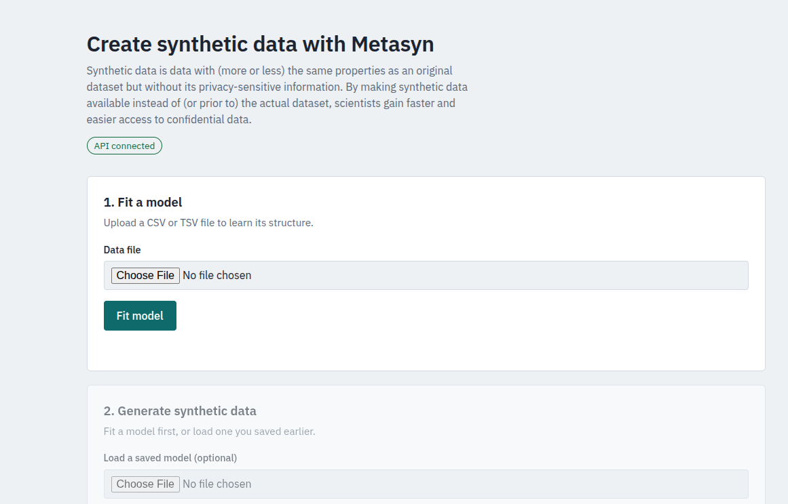
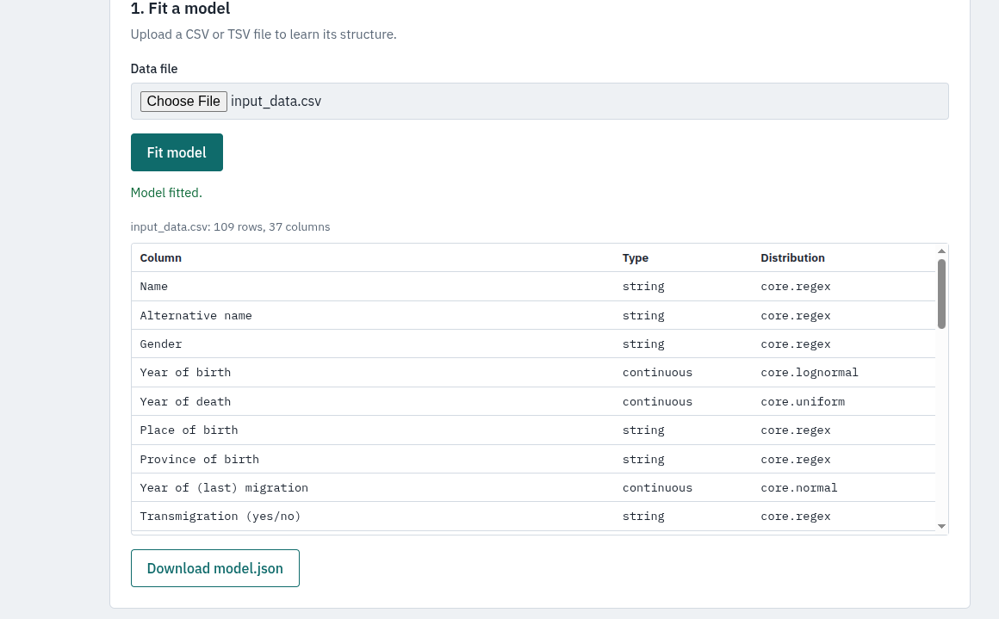
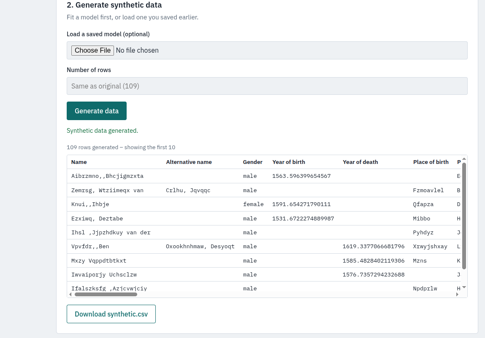

# Metasyn API prototype 

This folder contains the code for a fastAPI wrapper for metasyn. It exposes two endpoints: 
- /fit-model/ : accepts a CSV file, fits a metasyn model, and returns the model as GMF (JSON)
- /synthesize/ : accepts a fitted model (as JSON) and generates synthetic data as a CSV file

It does not include any authentication or security features, and is intended for local use and as a starting point for further development.

## File description 
- `main.py` contains the API app 
- `input_data.csv` contains a file from an open dataset in the SSH Data Station that is used as a testing example
- `synthetic.csv` contains the resulting synthetic version of the input data

## Instructions 

### Install packages
Optional: Create a virtual environment, for instance with uv: 
```bash
uv venv .env
```
Optional: Activate the virtual environment: 
```bash
source .env/bin/activate
```

Install the required Python packages: 
```
uv pip install -r requirements.txt
```
### Start the API

You can start the API with the following command: 

```bash
uvicorn main:app --reload
```

You can now see the documentation here and test the endpoints: 

```
http://127.0.0.1:8000/docs
```


### Start the user interface 
Run the following command to start the UI: 

```python
python frontend/app_flask.py
```

It will run on `http://127.0.0.1:5000`


#### Interface example usage

1. Initial page will show the option to upload a tabular file and generate a GMF



2. After the model is fitted you can download it 



3. And, if you scroll, down, you can have synthetic data generated using that model. Or, just upload another GMF to use that. 

4. When the data is generated it will show the first 10 lines and a button  to download the whole file. 




### Manually use the API endpoints
To save the model and synthetic data files to your disk manually without the UI, run the following commands: 

Fit model (upload CSV, save response):
``` bash
curl -s -F "file=@input_data.csv" http://127.0.0.1:8000/fit-model/ -o fit_response.json
```

Extract the model into a file:
```bash
jq '.model_json' fit_response.json > model.json
```

Build payload (necessary for next step):
```bash
jq -n --slurpfile m model.json '{model_json: $m[0], num_rows: 109}' > payload.json
```

Call synthesize: 
```bash
curl -s -H "Content-Type: application/json" -d @payload.json http://127.0.0.1:8000/synthesize/ -o synth_response.json
```

Extract csv:
```bash
jq -r '.synthetic_data_csv' synth_response.json > synthetic.csv

```


## AI use 
- `main.py` was written with the help of Lumo, the Proton AI assistant. 

## To do:
- add package requirements 
- turn instructions into bash script